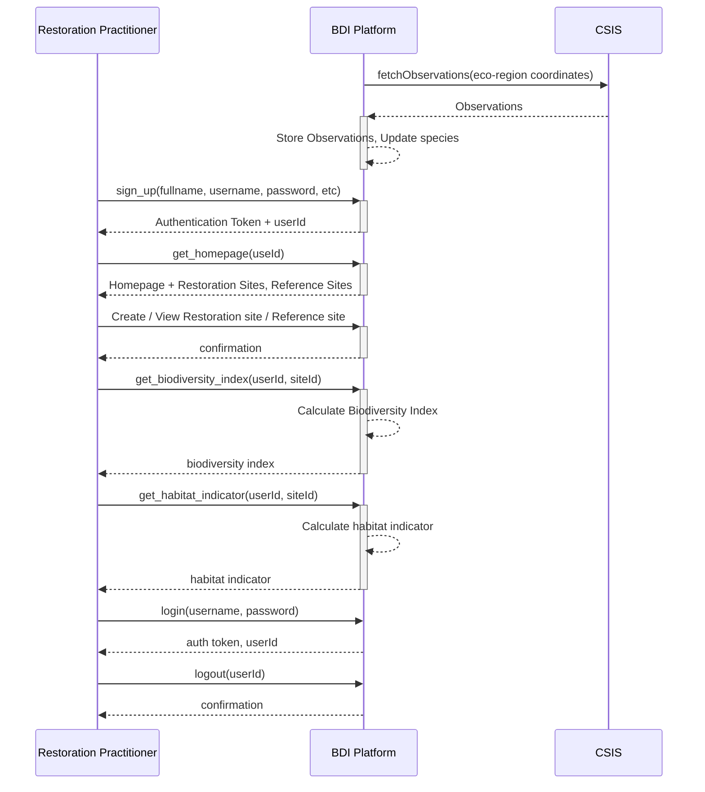

Impact is open-source online platform to help Restoration Practitioners to make data-driven decisions. 

It is intended to
1. improve "Plan -> Restore -> Observer -> Analyze" cycle.
2. provide meaningful insights about restoration projects to policy-makers, funding partners and clients.

## Context Map

## Scope
### Functional
1. Restoration Practitioners (RP) can demarcate restoration sites in supported bioregions
2. Restoration Practitioners can demarcate reference sites in supported bioregions
3. Biodiversity Index - Derived for a restoration site in-context of the bioregion where the site belongs to
4. Restoration Site -> Reference Site(s) Comparator - RP can select reference site(s) and compare her restoration site index with that of reference site(s)

### Quality Requirements
#### Scalability
1. Millions of observations to be processed from Crowdsource Species Identification System (CSIS) in the first fetch
2. Thousands of observations coming from CSIS(s) in subsequent fetches (depending on the fetch frequency & number of ecoregions supported)
3. Thousands of RPs - most RPs spending 1-2 hours/day

#### Availability
1. Aim for 99.9% up-time

#### Performance
1. < 2secs of web-page load-time at 95pt

## System's APIs

### System APIs Listing
1. sign_up(fullname, username, password, email, profileimage) -> auth token, userId
2. login(username, password) -> auth token, userId
3. logout(userId) -> confirmation
4. get_homepage(userId) -> homepage + RP's restoration and reference sites
5. create_site(userId, polygon, siteType) -> siteId. siteType - restoration | reference
6. update_site(userId, siteId, polygon, siteType) -> siteId
7. delete_site(userId, siteId) -> confirmation
8. get_biodiversity_index(userId, siteId) -> biodiversity index
9. get_habitat_indicator(userId, siteId) -> habitat indicator

## Roadmap
- [ ] Habitat Indicator -> indicates how a given restoration site is evolving over-time in-terms of habitat niches
- [ ] Ability to manage observations. In current version, RPs have to manage their observations at the supported Crowdsourced Species Identification System (CSIS)
- [ ] Native Mobile App Support
- [ ] Discussion Forum
